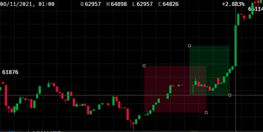

# preact-finance
A zero dependecy financial component library written in `preact` and `flexbox`. All components are built from scratch using canvas, lerp and linear interpolation. Market data is queried using `thegraph/uniswap-v3`. The project includes a hot-reload module and `scss` plugin for `esbuild`.

## Components

### `<MarketBox>`
The price of every hour for N hours fit in a `<polyline>` 

### `<Chart>`
Candle or mountain graph with support for zooming and drawing boxes to isolate trend areas and supports hotkeys 

### `<OrderBook>`
Highlights signficant amounts (resistance). Depth graph and order book synced through a reducer used in `OrderBookStore`  
